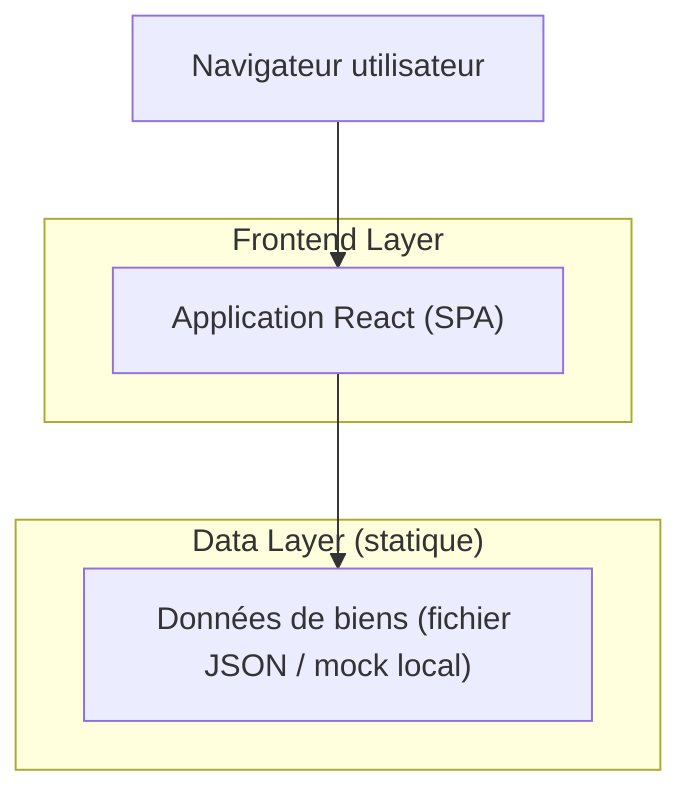

## 1.Architecture design

## 2.Technology Description
- Frontend: React@18 + vite + TypeScript + tailwindcss@3
- Backend: None (site vitrine + recherche locale)

## 3.Route definitions
| Route | Purpose |
|-------|---------|
| / | Accueil : vidéo villa, navigation, accès aux CTA, écran de chargement initial |
| /biens | Liste de biens + CTA “Demander une visite / dossier” |
| /recherche | Recherche avec filtres (À vendre/À louer, Jura/Jura bernois) + résultats |
| /demande-dossier | Formulaire contact + demande visite/dossier |

## 4.API definitions (If it includes backend services)
Non applicable (aucun backend).

## 5.Server architecture diagram (If it includes backend services)
Non applicable.

## 6.Data model(if applicable)
Non applicable (données statiques côté frontend).